# Game Arcade 🎮✨  
A Python-based **Arcade Hub** featuring 10+ mini-games — playable from a single launcher.


 


👉 **Screenshots:**  
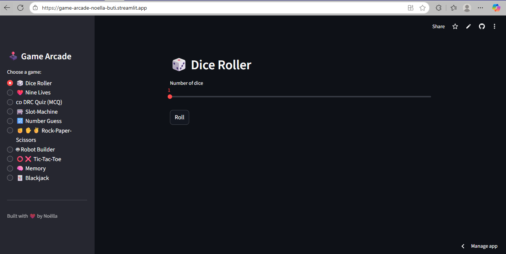  

---

## ✨ Overview
**Game Arcade** is a fun Python project bundling multiple interactive games into one app.  
It demonstrates Python scripting, object-oriented design, and simple game logic with a clean launcher.

---

## 🔍 Features
- 🎮 Multiple games under one roof
- 🖥️ Easy launcher with menu navigation
- 🃏 Randomized outcomes for variety
- 📷 Simple graphics/screenshots for a visual experience
- 💾 Modular design — each game in its own script

---

## 🚦 Quickstart
```bash
# Clone the repo
git clone https://github.com/NoellaButi/game-arcade.git
cd game-arcade

# Create venv & install requirements
python -m venv .venv
source .venv/bin/activate   # Windows: .\.venv\Scripts\activate
pip install -r requirements.txt

# Launch Arcade
python app.py
```

## 📁 Repository Layout
```bash
game-arcade/
├─ app.py              # Main launcher
├─ requirements.txt    # Dependencies
├─ games/              # Individual games
│  ├─ dice_roller.py
│  ├─ nine_lives.py
│  ├─ mboka_quiz.py
│  ├─ slot_machine.py
│  ├─ number_guess.py
│  ├─ rps.py
│  ├─ robot_builder.py
│  ├─ tictactoe.py
│  ├─ memory.py
│  └─ blackjack.py
└─ docs/               # Screenshots/demos
```

🎲 Games Included
- 🎲 Dice Roller — roll dice and get instant results
- 🐱 Nine Lives — guess the hidden word with limited tries
- 🌍 Mboka Quiz — DRC-themed quiz (geography, culture, history)
- 🎰 Slot Machine — spin reels and test your luck
- 🔢 Number Guess — guess the secret number
- ✊ Rock-Paper-Scissors — classic hand game vs computer
- 🤖 Robot Builder — assemble a random robot
- ❌ Tic-Tac-Toe — play vs CPU or friend
- 🧠 Memory — flip and match card pairs
- 🃏 Blackjack — card game against dealer

👉 Example Screenshots:

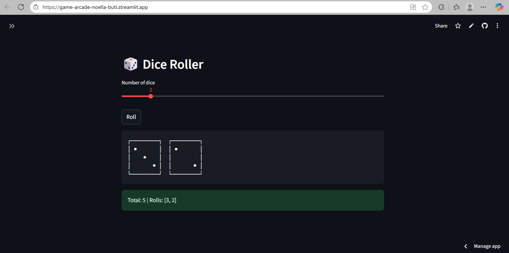  
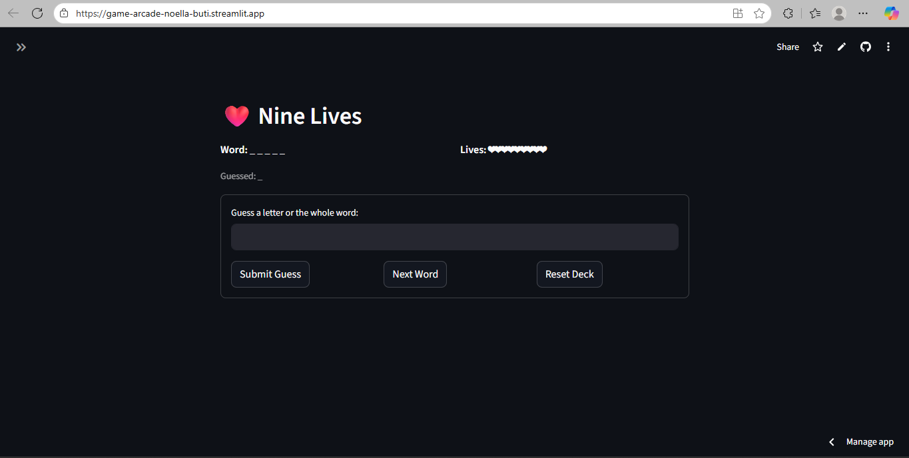  
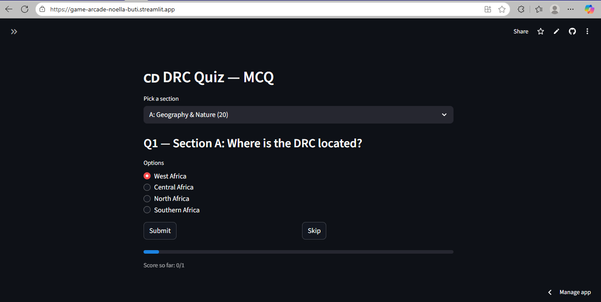  
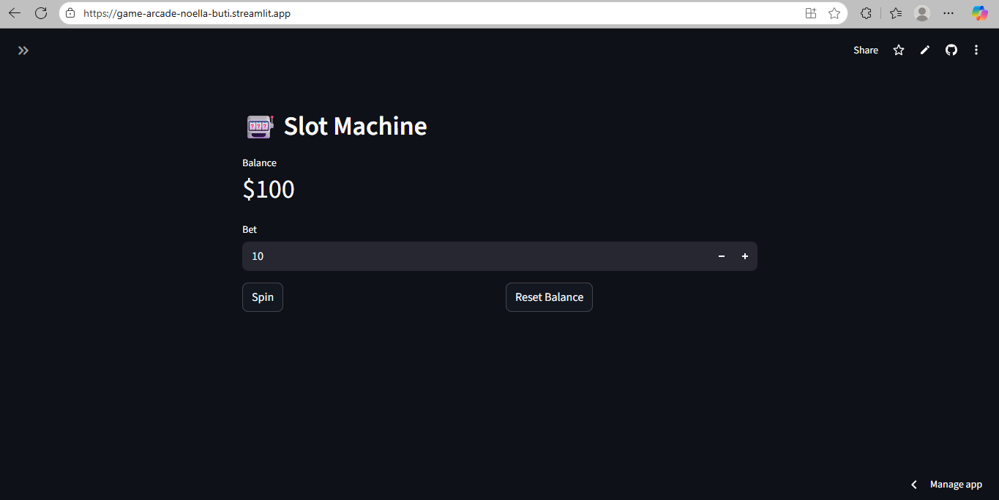  
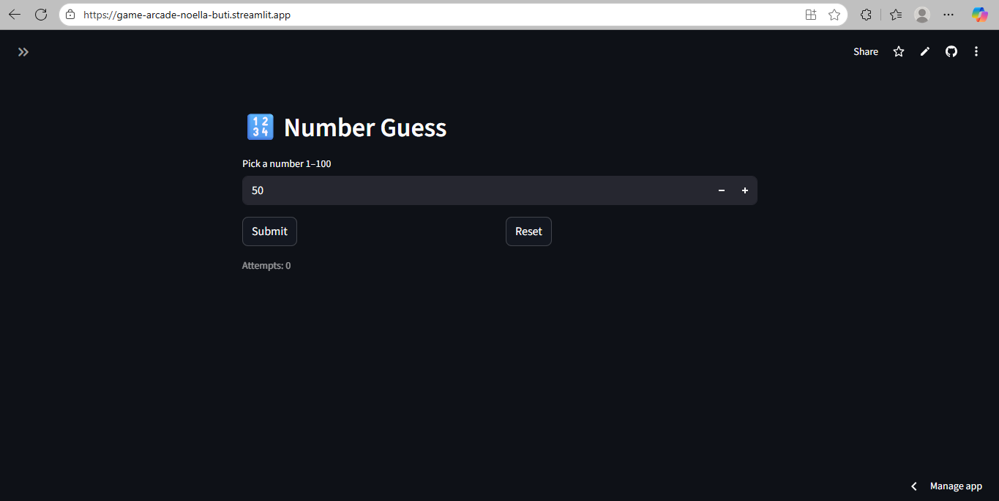  
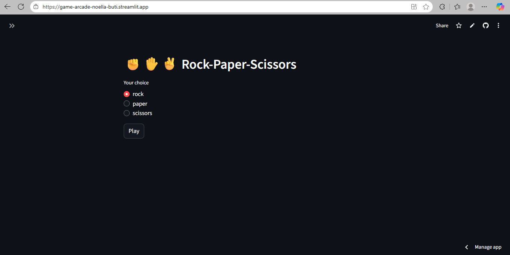  
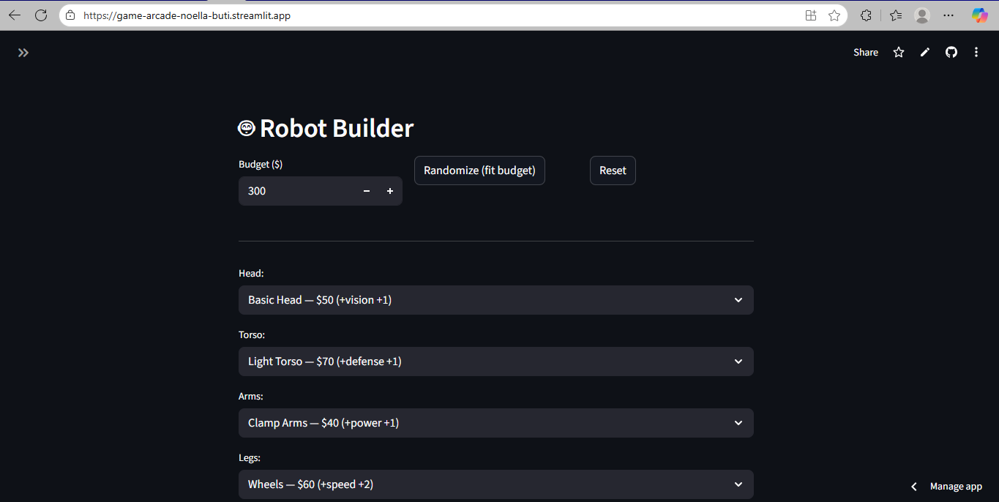  
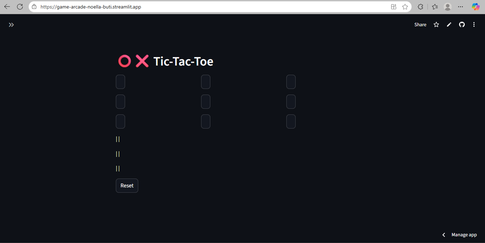  
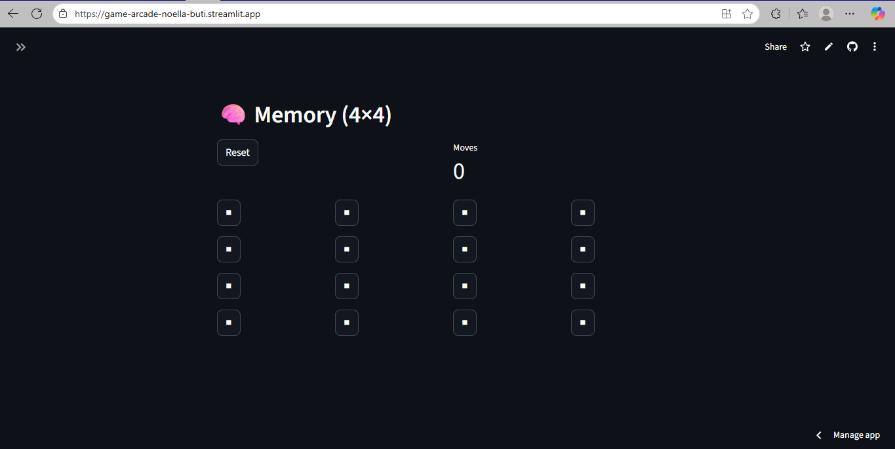  
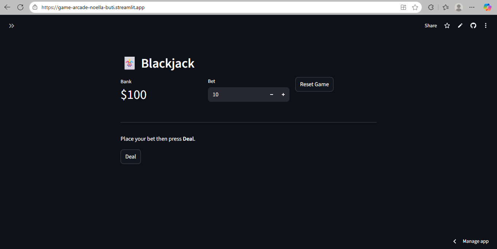  


## 🔮 Roadmap
- Add multiplayer mode (online/local)
- Add scoreboards & persistence
- Improve GUI with animations

## 📜 License
MIT (see LICENSE)

---
